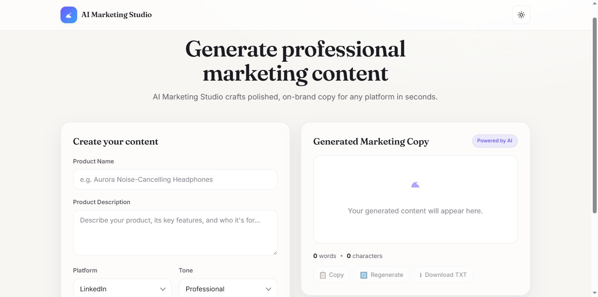
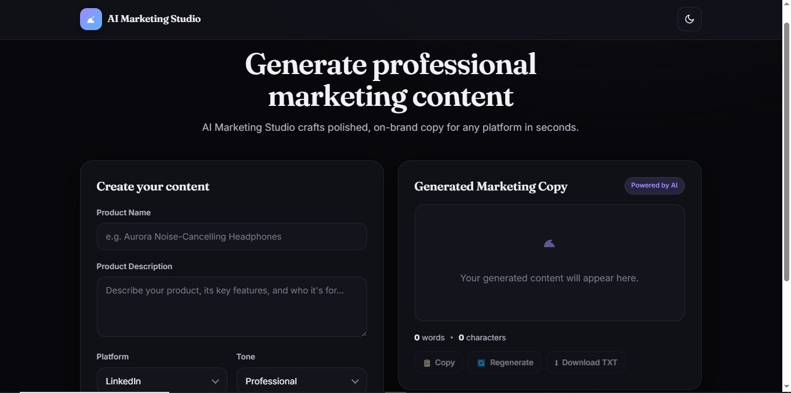
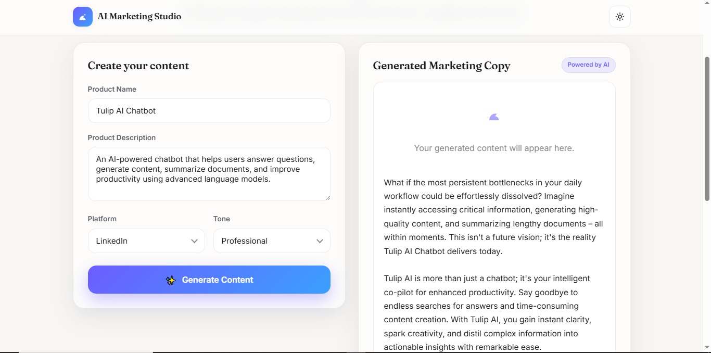

# AI Marketing Studio 🚀

AI Marketing Studio is a web application built with Flask that generates high-quality marketing content using Generative AI.

The application automatically creates platform-specific marketing copy for LinkedIn, Instagram, Facebook, X (Twitter), Email, Website, and Blog posts.

To ensure reliability, the application uses **Google Gemini** as the primary AI provider and automatically falls back to **Groq** if Gemini is unavailable.

---

## Project Objective

This project was developed as part of the DecodeLabs Generative AI Training Program.

The objective was to build an AI-powered marketing content generator using Flask and Large Language Models (LLMs), while implementing prompt engineering, AI integration, and automatic AI provider fallback.

---

## Features

- AI-powered marketing content generation
- Google Gemini integration
- Automatic Groq fallback
- Platform-specific content generation
- Multiple writing tones
- Automatic language detection
- Copy generated content
- Regenerate content
- Download generated content as TXT
- Word and character counter
- Modern responsive UI
- Light / Dark mode
- Flask backend
- REST API architecture

---

## Supported Platforms

- LinkedIn
- Instagram
- Facebook
- X (Twitter)
- Email
- Website
- Blog

---

## Technologies Used

- Python
- Flask
- Google Gemini API
- Groq API
- HTML
- CSS
- JavaScript

---

## Screenshots

### Light Mode



---

### Dark Mode



---

### Generated Content



Example of AI-generated marketing.

---

## Project Structure

```text
AI-Marketing-Studio/
│
├── app.py
├── requirements.txt
├── README.md
├── .gitignore
│
├── templates/
│   └── index.html
│
├── static/
│   ├── style.css
│   └── script.js
│
├── screenshots/
│
└── public/
│   └── UI assets
```

---

## How It Works

1. Enter the product name.
2. Enter the product description.
3. Select the target platform.
4. Choose the desired writing tone.
5. Click **Generate Content**.
6. The application generates optimized marketing copy using Google Gemini.
7. If Gemini is unavailable, the system automatically switches to Groq.
8. Users can copy, regenerate, or download the generated content as a TXT file.

---

## Installation

```bash
git clone <repository-url>

cd AI-Marketing-Studio

pip install -r requirements.txt
```

---

## Environment Variables

Create a `.env` file.

```env
GEMINI_API_KEY=your_gemini_api_key
GROQ_API_KEY=your_groq_api_key

# Groq is automatically used if Gemini is unavailable.
```


---

## Run

```bash
python app.py
```

Open your browser:

```
http://127.0.0.1:5000
```

---

## AI Features

- Marketing content generation
- Platform-aware writing
- Tone adaptation
- Automatic language detection
- Storytelling generation
- Human-like copywriting
- AI provider fallback
- Intelligent prompt engineering
- Automatic failover between AI providers

---

## Future Improvements

- OpenRouter integration
- PDF export
- DOCX export
- User authentication
- Content history
- Database support
- AI streaming responses
- Multiple AI models

---

## Author

**Oula Hanandeh**

Generative AI Intern @ DecodeLabs

- GitHub: https://github.com/olasaleemhanandeh-ux
- LinkedIn: https://www.linkedin.com/in/oula-hanandeh-2b275a299/